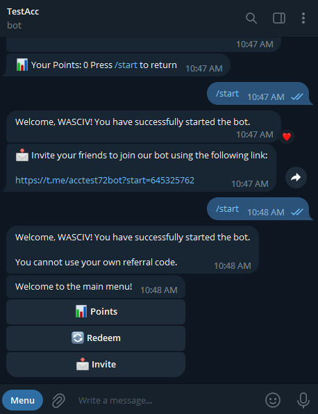

# Point Manager Bot

Point Manager Bot is a Telegram bot that allows you to boost your channel and distribute items by making Your Subs as referrer 

## How to use the this Telegram Bot in Windows?

1. First of create a Bot from @Botfather and I Assume you have an Account on Telegram

2. Name it and give it username as it asks

3. It will give you a Bot Token (Something like this 1334385210:AAEn-8Jeb_vcyE5ww2RFfj78K4diZ7UlEFE )

## Lines To Replace Before you use Bot.py for your Channel

In Line 9 of the Bot.py Replace YOUR_BOT_TOKEN_HERE with BOT Token Given By @BotFather

In Line 22 of the Bot.py Replace YOUR_BOT_TOKEN_HERE with BOT Token Given By @BotFather

In Line 23 of the Replace YOUR_CHANNEL_USERNAME with your Channel's Username

In Line 80-88 You can replace those menu with the desired item you desired to give subs

In Line 219 Replace @channel_username with Your channel useranme [Eg:- @channel with @forever_knightss]

In Line 272 Replace YOUR_TELEGRAM_CHANNEL_URL with your channel url the public line 

In Line 269 Replace YOUR_CHAT_ID with Your UserID [You can aquire that from @userinfobot]

In Line 375 of the Bot.py Replace YOUR_BOT_TOKEN_HERE with BOT Token Given By @BotFather

In Line 177 USERNAME_OF_BOT should be replaced by The BOT's usernname [IMPORTANT]

## Video Tutorial On How to Use ?

https://youtu.be/vTO4iUxe-kw

## Screenshots

## Contributions

Contributions are welcome! If you find a bug or have a feature request, please open an issue on GitHub.

## License

This project is licensed under the [MIT License](https://github.com/WASCIV/Forevermail/blob/main/LICENSE).

## Follow me on Instagram

Don't forget to follow me on Instagram [@wasiqhatesinsta](https://www.instagram.com/wasiqhatesinsta/) for more projects and updates!

## Join Us On Telegram

Don't forget to follow me on Instagram [@forever_knightss](https://t.me/+iaTYOodcEuU3YjFl) for more projects and updates!